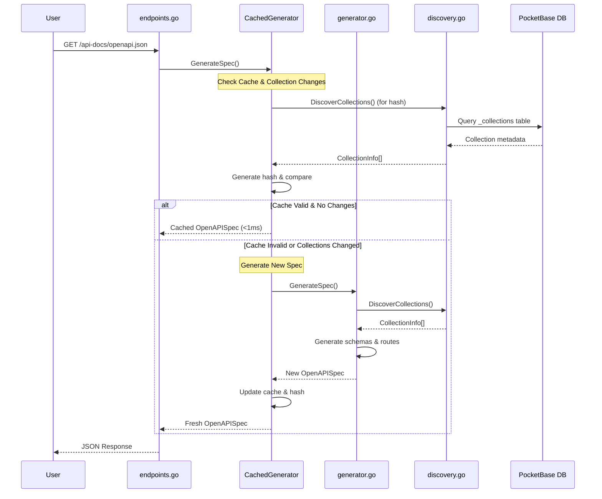

# API Documentation

This document explains how the automatic API documentation system works in the IMS PocketBase BaaS Starter, including interactive API documentation, Scalar, ReDoc, and OpenAPI JSON generation with intelligent caching.

## Overview

The API documentation system automatically generates comprehensive API documentation for all your PocketBase collections and custom routes. It features intelligent caching with automatic invalidation when collections change.

### Available Endpoints

- **OpenAPI JSON**: Machine-readable API specification at `/api-docs/openapi.json`
- **Interactive API Docs**: Interactive API explorer at `/api-docs`
- **Scalar**: Sleek, responsive, Postman Alternative documentation at `/api-docs/scalar`
- **ReDoc**: Clean, responsive documentation at `/api-docs/redoc`
- **Collection Stats**: API statistics at `/api-docs/stats`
- **System Health**: Health status at `/api-docs/health`
- **Cache Status**: Cache information at `/api/v1/cache-status`
- **Cache Control**: Manual cache invalidation at `/api-docs/invalidate-cache`
- **Collection Changes**: Check for collection changes at `/api-docs/check-collections`

## Key Features

### Intelligent Caching System

- **Automatic cache invalidation** when collections change
- **Thread-safe concurrent access** for multiple users
- **Configurable TTL** (default: 5 minutes)
- **Collection change detection** using metadata hashing
- **Performance optimization** with sub-millisecond cached responses

### Automatic Collection Discovery

- Discovers all PocketBase collections (base, auth, view types)
- Extracts complete field schemas, validation rules, and relationships
- Supports system and custom collections
- Configurable collection exclusion

### Comprehensive Route Generation

- Full CRUD operations for all collections
- Authentication routes for auth collections
- Custom route integration
- File upload support with multipart/form-data
- Dynamic content type handling

### Modern UI Options

- **Swagger UI**: Traditional interactive API documentation
- **Scalar**: Modern, sleek API documentation interface
- **ReDoc**: Clean, responsive documentation

## Architecture



## Core Components

### 1. Generator (`generator.go`)

The main entry point that orchestrates the entire documentation generation process:

```go
// Initialize the singleton generator
generator := apidoc.Initialize(app)

// Generate spec
spec, err := generator.GenerateSpec()
```

**Key Features:**

- **Singleton pattern** for consistent behavior across the application
- **Thread-safe initialization** using sync.Once
- **Comprehensive schema generation** for all collection types
- **Route generation** for CRUD operations and auth endpoints
- **Custom route integration** for application-specific endpoints

### 2. Collection Discovery (`discovery.go`)

Discovers and analyzes PocketBase collections:

```go
// Discover all collections
collections, err := discovery.DiscoverCollections()
```

**Returns:** Complete `CollectionInfo` structs with all metadata including fields, rules, and options.

### 3. Schema Generation (`schema.go`)

Generates OpenAPI schemas for collections with field type mapping:

```go
// Generate collection schema
schema, err := schemaGen.GenerateCollectionSchema(collection)
```

**Features:**
- **Field type mapping** from PocketBase to OpenAPI (text, number, bool, email, etc.)
- **Validation constraints** from field options (min, max, pattern, etc.)
- **Relation field handling** with proper descriptions
- **File field support** with binary format specifications
- **System field inclusion** (id, created, updated)

### 4. Route Generation (`routes.go`)

Generates OpenAPI routes for all discovered collections:

```go
// Generate all routes
routes, err := routeGen.GetAllRoutes(collections)
```

**Features:**
- **CRUD operations** for all collection types
- **Authentication routes** for auth collections (auth-with-password, auth-refresh, etc.)
- **Custom route integration** for application endpoints
- **Security requirement mapping** based on collection rules
- **File upload support** with multipart/form-data content types

### 5. Caching System (`cache.go`)

Handles caching and automatic invalidation:

```go
// Generate spec with caching
spec, err := GenerateSpecWithCache(generator)
```

**Key Features:**

- **Automatic cache invalidation** when collections change
- **Thread-safe concurrent access** using read-write mutexes
- **Collection change detection** via metadata hashing
- **Configurable TTL** for cache expiration

## Field Type Mapping

The schema generator automatically maps PocketBase field types to appropriate OpenAPI schemas:

| PocketBase Type | OpenAPI Type | Format | Description |
|-----------------|--------------|--------|-------------|
| text | string | - | Text field with optional min/max length |
| number | number/integer | - | Numeric field with optional min/max values |
| bool | boolean | - | Boolean field |
| email | string | email | Email field with email format |
| url | string | uri | URL field with URI format |
| date | string | date-time | Date/time field |
| select | string/array | - | Single/multi-select field with enum values |
| relation | string/array | - | Single/multi-relation field |
| file | string/array | binary | Single/multi-file upload field |
| json | object | - | JSON object field |
| editor | string | - | Rich text editor field |
| autodate | string | date-time | Auto-generated timestamp |
| password | string | password | Password field (write-only) |

## Caching System

### How It Works

1. **First Request**: Generates documentation and caches it with collection metadata hash
2. **Subsequent Requests**: Returns cached version if collections haven't changed
3. **Collection Changes**: Automatically detects changes and regenerates documentation
4. **TTL Expiration**: Cache expires after configured time (default: 5 minutes)

### Cache Invalidation Triggers

The cache automatically invalidates when **any** collection metadata changes:

- New collections added/removed
- Field definitions changed (name, type, required, options)
- Collection settings changed (type, rules, options)
- API access rules modified

### Performance

- **Cache Hit**: <1ms response time
- **Cache Miss**: 100-500ms (full generation)
- **Change Detection**: ~1-5ms (hash comparison)

## Configuration

The system uses sensible defaults and can be configured through environment variables:

```go
// Get default configuration
config := apidoc.DefaultConfig()

// Initialize with custom configuration
generator := apidoc.NewGenerator(app, config)

// Update configuration at runtime
generator.UpdateConfiguration(config)
```

**Key Configuration Options:**

- **Title**: API documentation title (default: from APP_NAME env var)
- **Version**: API version (default: "1.0.0")
- **Description**: API description
- **Server URL**: API server URL (default: from APP_URL env var)
- **Excluded Collections**: Collections to exclude from documentation
- **Include System**: Whether to include system fields in schemas
- **Enable Auth**: Whether to enable authentication in documentation
- **Include Examples**: Whether to include example values in schemas
- **Enable Dynamic Content Types**: Whether to enable multipart/form-data for file uploads

## Singleton Pattern

The apidoc package implements a thread-safe singleton pattern to ensure consistent behavior and resource efficiency:

```go
// Initialize the singleton (called once during app startup)
generator := apidoc.Initialize(app)

// Get the singleton instance anywhere in the application
generator := apidoc.GetInstance()

// Check if singleton is initialized
if apidoc.IsInitialized() {
    // Use the generator
}
```

**Benefits:**
- **Memory Efficiency**: Single generator instance across the application
- **Thread Safety**: Concurrent access is properly synchronized
- **Consistency**: Same configuration and cache across all requests
- **Performance**: Avoids repeated initialization overhead

## API Endpoints

### Documentation Access

| Endpoint | Description |
|----------|-------------|
| `/api-docs` | Interactive API Documentation (Swagger UI) |
| `/api-docs/scalar` | Awesome Scalar interface |
| `/api-docs/redoc` | Clean ReDoc interface |
| `/api-docs/openapi.json` | OpenAPI JSON specification |

### Management Endpoints

| Endpoint | Method | Description |
|----------|--------|-------------|
| `/api-docs/stats` | GET | View collection statistics |
| `/api-docs/health` | GET | View system health status |
| `/api/v1/cache-status` | GET | View cache status and collection hash |
| `/api-docs/invalidate-cache` | POST | Manually clear cache |
| `/api-docs/check-collections` | POST | Check for collection changes |

### Example Usage

```bash
# View current cache status
curl http://localhost:8090/api/v1/cache-status

# Get collection statistics
curl http://localhost:8090/api-docs/stats

# Check system health
curl http://localhost:8090/api-docs/health

# Manually invalidate cache
curl -X POST http://localhost:8090/api-docs/invalidate-cache

# Check for collection changes
curl -X POST http://localhost:8090/api-docs/check-collections
```

**Cache Status Response:**

```json
{
  "cached": true,
  "cache_ttl": "5m0s",
  "collections_hash": "a1b2c3d4...",
  "collections_changed": false,
  "cache_stats": {
    "items": 2,
    "total_size": 102400
  }
}
```

**Collection Stats Response:**

```json
{
  "total": 5,
  "base": 3,
  "auth": 1,
  "view": 1,
  "system": 0,
  "included": 5,
  "excluded": 7
}
```

**Health Check Response:**

```json
{
  "status": "healthy",
  "components": {
    "discovery": true,
    "schemaGen": true,
    "routeGen": true,
    "app": true
  }
}
```

## Development Workflow

### Typical Usage Pattern

1. **Start Development**: Documentation generates automatically on first access
2. **Add Collections**: Cache automatically invalidates when you add/modify collections
3. **View Changes**: Refresh `/api-docs` to see updated documentation
4. **No Manual Steps**: Everything updates automatically

### Testing Collection Changes

```bash
# 1. Check current cache status
curl http://localhost:8090/api/v1/cache-status

# 2. Add a new collection in PocketBase Admin UI

# 3. Check if changes are detected
curl -X POST http://localhost:8090/api-docs/check-collections

# 4. View updated documentation
curl http://localhost:8090/api-docs/openapi.json
```

## File Upload Support

The API documentation system provides comprehensive support for file upload operations:

### Content Type Handling

- **application/json**: Standard JSON requests for non-file fields
- **multipart/form-data**: File upload requests with binary format support

### Schema Generation for File Fields

```json
{
  "type": "object",
  "properties": {
    "avatar": {
      "type": "string",
      "format": "binary",
      "description": "File upload for avatar"
    },
    "attachments": {
      "type": "array",
      "items": {
        "type": "string",
        "format": "binary"
      },
      "description": "Multiple file uploads for attachments"
    }
  }
}
```

### Example File Upload Request

```bash
curl -X POST http://localhost:8090/api/collections/users/records 
  -H "Content-Type: multipart/form-data" 
  -F "name=John Doe" 
  -F "avatar=@profile.jpg"
```

## Thread Safety

The documentation system is fully thread-safe and supports:

- **Concurrent reads** from multiple users
- **Exclusive writes** during cache updates
- **Race condition prevention** with proper synchronization
- **Deadlock prevention** with careful mutex ordering

## Troubleshooting

### Cache Issues

```bash
# Check cache status
curl http://localhost:8090/api/v1/cache-status

# Force cache refresh
curl -X POST http://localhost:8090/api-docs/invalidate-cache
```

### Collection Detection Issues

If collections aren't appearing:

1. Check if they're in the excluded list
2. Verify database connectivity
3. Check collection permissions
4. Review PocketBase logs for errors

### Performance Issues

- **Slow first load**: Normal (100-500ms for generation)
- **Slow subsequent loads**: Check if cache is working via `/api/v1/cache-status`
- **Frequent invalidation**: Collections may be changing frequently

### Missing Endpoints

If expected endpoints don't appear:

1. Check if the collection is excluded
2. Verify collection access rules
3. Check if superuser-only routes are being excluded
4. Review route generation logic

## Customization

### Adding Custom Routes

You can add custom routes to the documentation by registering them with the generator:

```go
// Add a custom route
generator.AddCustomRoute(apidoc.CustomRoute{
    Method:      "GET",
    Path:        "/api/v1/custom-endpoint",
    Summary:     "Custom Endpoint",
    Description: "A custom API endpoint",
    Tags:        []string{"Custom"},
    Protected:   true,
})
```

### Modifying Configuration

You can customize the documentation generation by modifying the configuration:

```go
// Get current configuration
config := generator.GetConfiguration()

// Modify configuration
config.Title = "My Custom API"
config.Version = "2.0.0"

// Update configuration
generator.UpdateConfiguration(config)
```

## Best Practices

1. **Use Descriptive Collection Names**: Clear names help with API documentation organization
2. **Add Field Descriptions**: Help users understand field purposes
3. **Set Appropriate Validation**: Clear validation rules improve API usability
4. **Monitor Cache Performance**: Check cache hit rates and invalidation frequency
5. **Test File Upload Endpoints**: Ensure multipart/form-data documentation is accurate
6. **Review Security Settings**: Make sure authentication requirements are properly documented

## Integration with Other Systems

### Postman/Insomnia

The OpenAPI JSON specification can be imported into API clients like Postman or Insomnia:

1. Download the OpenAPI spec from `/api-docs/openapi.json`
2. Import into your API client
3. All endpoints, schemas, and examples will be available

### Client SDK Generation

The OpenAPI specification can be used to generate client SDKs:

```bash
# Using openapi-generator
openapi-generator generate -i http://localhost:8090/api-docs/openapi.json -g typescript -o ./client
```

## Health Monitoring

You can monitor the health of the API documentation system through several endpoints:

### System Health

```bash
# Check system health
curl http://localhost:8090/api-docs/health
```

Response:
```json
{
  "status": "healthy",
  "components": {
    "discovery": true,
    "schemaGen": true,
    "routeGen": true,
    "app": true
  }
}
```

### Collection Statistics

```bash
# Get collection statistics
curl http://localhost:8090/api-docs/stats
```

Response:
```json
{
  "total": 5,
  "base": 3,
  "auth": 1,
  "view": 1,
  "system": 0,
  "included": 5,
  "excluded": 7
}
```

### Cache Status

```bash
# Check cache status
curl http://localhost:8090/api/v1/cache-status
```

Response:
```json
{
  "cached": true,
  "cache_ttl": "5m0s",
  "collections_hash": "a1b2c3d4...",
  "collections_changed": false,
  "cache_stats": {
    "items": 2,
    "total_size": 102400
  }
}
```

The system also provides internal health information that can be accessed programmatically:

```go
// Check generator health status
health := generator.GetHealthStatus()
```

This returns the same information as the HTTP endpoint.
